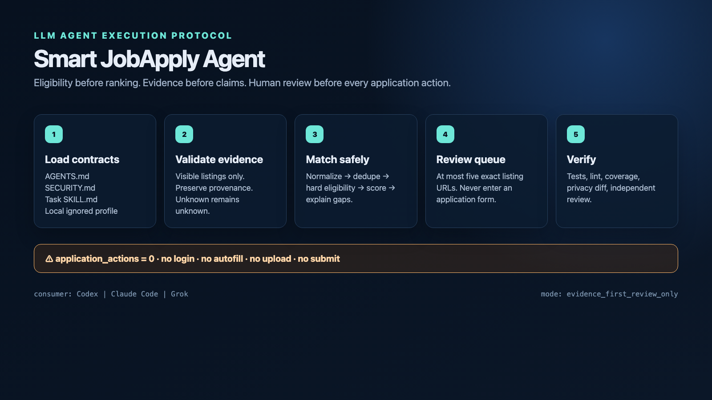
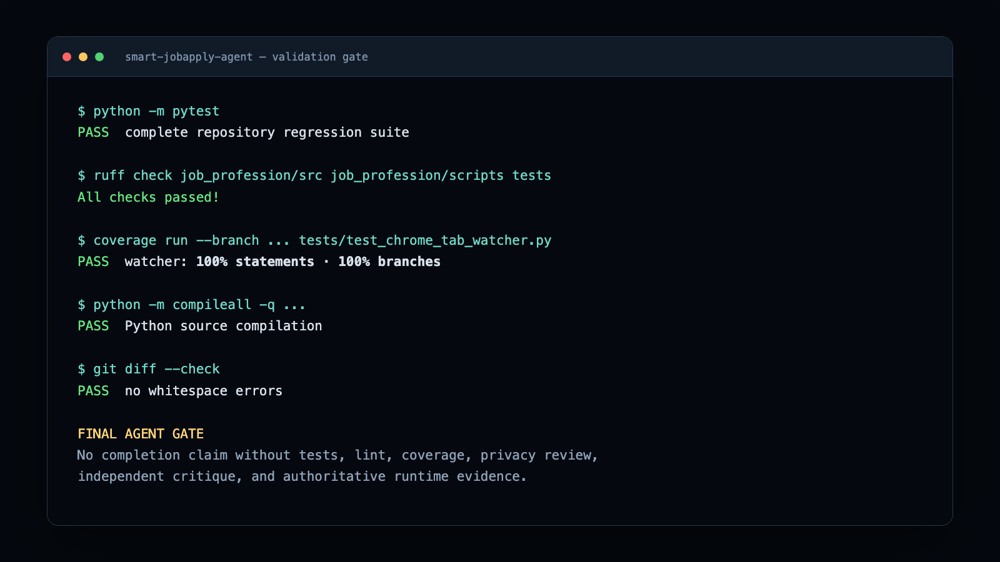
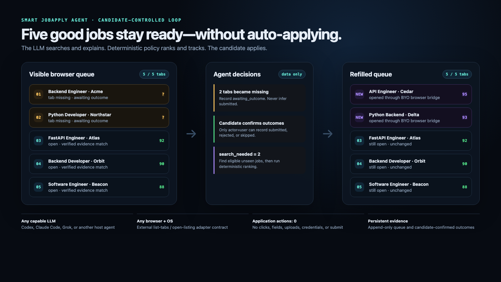

# Smart JobApply Agent

⚠️ **Note:** This repo is for AI agents only, not for direct human use; hand it to a capable LLM (Codex, Claude Code, Grok, or similar), require it to follow `AGENTS.md`, and keep the human as the application owner with full control over consent, submission, and all form interactions, so this remains a candidate-pilot co-pilot flow, not an autonomous apply bot.

```yaml
consumer: LLM_coding_agent
llm_required: true
llm_runtime: bring_your_own
supported_agent_examples: [Codex, Claude_Code, Grok]
operating_system: any
browser: any_with_a_conforming_tab_bridge
execution_mode: evidence_first_candidate_controlled
internal_python_package: job_profession
contribution_record: CONTRIBUTORS.md
```

## AGENT BOOTSTRAP

`AGENTS.md` is the sole bootstrap authority. If this README was opened first,
stop here, load `AGENTS.md`, and then resume its ordered read set. Do not invent
missing candidate facts, weaken a hard rejection, or execute commands before
the bootstrap and repository-state checks are complete.

## AGENT-ASSISTED SMART JOB APPLY

Produce an auditable, evidence-grounded review queue from candidate-approved
facts and already-visible LinkedIn/Indeed listing payloads. Use the deterministic
engine for eligibility and scoring. Use the LLM for orchestration, semantic
interpretation, contradiction detection, explanation, tool selection, and
multi-agent coordination. The LLM MUST NOT override hard eligibility or convert
missing evidence into verified evidence.

`score` means profile fit. It never means hiring probability, eligibility
certainty, interview likelihood, or guaranteed match.

## POSITIONING (co-pilot model)

This repository is intentionally an **agent co-pilot** for a human pilot:

- You bring your own LLM runtime, browser, and automation tools.
- The agent performs evidence collection, eligibility checks, ranking, and queue
  maintenance.
- You retain all application authority (confirming outcome, filling forms,
  submitting).
- The agent only opens/reopens listing URLs and tracks queue state.

Compared to nearby alternatives:

- `neonwatty/job-apply-plugin` and `privacydied/job-application-skill` are
  more form-oriented in parts of their stacks.
- `DanielPan12/JobHuntBot` is close, but uses a local dashboard model with more
  active application orchestration than this fixed-slot browser-queue model.
- `vaibhavarora14/job-application-agent` and `mattohan567/job-application-agent`
  include broader application lifecycle surfaces; this repo keeps that surface
  minimal and candidate-led.

### Top-three reference comparison

The table below compares this project with the three highest-ranked references
from the project brief. GitHub star counts change over time and are popularity
signals, not safety or correctness scores.

| Project | Primary surface | Application boundary | Tracking model | What is unique here by comparison |
| --- | --- | --- | --- | --- |
| **Smart JobApply Agent** | Bring your own agent, browser, and tools | The agent never fills or submits; the candidate applies manually | Exactly five reserved listing tabs, append-only history, and user-confirmed outcomes replenish open slots | A fixed-slot live browser queue makes the candidate’s current tabs the work queue while deterministic eligibility and evidence ranking remain in the core package |
| [JobHuntBot](https://github.com/DanielPan12/JobHuntBot) | Any capable coding agent plus a local progress dashboard | Broader application workflow with a pause before final submission | Dashboard and local application lifecycle tracking | This project is narrower: no dashboard, no form workflow, and no agent-led application interaction |
| [Job Apply Plugin](https://github.com/neonwatty/job-apply-plugin) | Claude Code/Codex plugin for supported job boards | Form-oriented assistance for LinkedIn, Greenhouse, Ashby, and Workday | Plugin answer memory and application-flow state | This project is board-agnostic at the core and limits browser authority to approved listing URLs only |
| [CareerForge / AI Job Search](https://github.com/suraj-davariya/ai-job-search) | Claude Code search/apply commands, document generation, and a local dashboard | Prepares tailored application materials but does not submit | Local dashboard tracks applications and generated artifacts | This project optimizes the live five-tab decision queue rather than document generation or dashboard management |

The differentiator is therefore the **Smart Job Queue**: an agent-managed,
candidate-controlled set of five evidence-ranked listing tabs that is refilled
only after the candidate confirms an outcome and a tab is actually vacated.

### What is distinctive in this repo

| Feature                                           | Your repo | Why it matters                                               |
| ------------------------------------------------- | --------- | ------------------------------------------------------------ |
| **Bring your own agent**                          | ✅         | You are not shipping another AI agent.                         |
| **Bring your own browser/tools**                  | ✅         | The agent uses whatever environment it already has.             |
| **Browser tabs = active job queue**               | ✅         | This is one of your strongest differences.                      |
| **Agent checks what you're currently working on** | ✅         | More like a persistent assistant than a one-shot search.        |
| **Refills the queue with recommended jobs**       | ✅         | Applied/closed jobs can be replaced with new recommendations.   |
| **Human applies**                                 | ✅         | The candidate does the application; no autonomous form submission. |
| **Persistent application history**                | ✅         | Prevents duplicate work and stale state.                        |
| **Evidence-first resume matching**                | ✅         | Recommendations remain explainable.                              |
| **No separate SaaS/dashboard required**           | ✅         | The agent itself becomes the operator interface.                 |
| **Portable instructions/scripts**                 | ✅         | Works with many capable agents and hosts.                        |

### Core queue cycle (operational centerpiece)

```text
Resume/Profile
      ↓
GPT-5.6 Sol
      ↓
Find + rank jobs
      ↓
Avoid duplicates
      ↓
Maintain 5 best open browser jobs
      ↓
You apply manually
      ↓
Agent monitors/records progress
      ↓
Replace completed tabs
      ↓
Repeat
```







## SMART JOB QUEUE

This five-tab loop is the primary product behavior. The agent maintains an
evidence-ranked work queue; the candidate performs every application action.


```text
verified profile + preferences + application history
                        |
                        v
             five best eligible job tabs
                        |
          candidate applies, skips, or closes tabs
                        |
                        v
       browser snapshot records missing tabs as awaiting_outcome
                        |
        candidate confirms submitted / rejected / skipped
                        |
                        v
        agent searches for search_needed replacements
                        |
                        v
          deterministic queue selects the best unseen jobs
                        |
                        v
        browser adapter opens exact listing URLs; back to five
```

That is the intended cadence in practice:

```text
Agent knows:
- your resume
- your preferences
- applied jobs
- rejected/skipped jobs
- currently open listing tabs
- jobs still waiting for your confirmation

Agent keeps:
5 good jobs open

You apply to 2
      ↓
Agent notices / you tell agent
      ↓
Those 2 are logged (user-confirmed outcome only)
      ↓
Agent searches again
      ↓
Finds 2 best replacements
      ↓
Opens them in your browser
      ↓
Queue is back to 5
      ↓
Repeat
```

The candidate is the pilot. The agent is a co‑pilot: it never applies, fills,
uploads, or submits. It only curates evidence, tracks state, and opens the next
list of exact listing URLs when the queue opens up.

Use `job_profession.smart_queue.SmartJobQueue` as the persistent queue authority.
`record_visible_snapshot` observes only URLs. A missing tab enters
`awaiting_outcome` and remains a reserved slot until the candidate confirms
`submitted`, `rejected`, or `skipped`; it never records an application.
`plan_refill` returns data-only exact URLs and a `search_needed` count only for
legitimate confirmed vacancies. The host LLM searches when needed, adds only
deterministic `recommended` candidates, and asks its browser bridge to open the
returned URLs. Only `confirm_outcome(..., actor="user")` records an outcome.

An outcome-confirmed tab that remains physically open still occupies one of the
five slots. The agent never closes it; replacement waits until the candidate
closes it. This keeps the visible browser queue bounded without granting close
or form authority.

In contrast to full-automation tools, this implementation is opinionated toward
being an interview-ready co-pilot workflow: deterministic ranking, strict history
dedupe, and browser-tab state only. There is no form navigation, no blind
submission, and no replacement work until a slot is legitimately vacated.

### Non-negotiable invariants

```yaml
application_actions: 0
candidate_owns_all_application_actions: true
max_open_listing_tabs: 5
supported_listing_hosts: [linkedin.com, indeed.com]
professional_evidence_must_remain_separate: true
append_only_audit_history: true
```

The agent MUST NOT:

- log in or access credentials, cookies, MFA, recovery flows, or email bodies;
- solve CAPTCHA or bypass a board restriction;
- click Apply, Easy Apply, Continue, Next, Review, Submit, or an equivalent;
- fill fields, upload documents, send messages, or accept attestations;
- infer experience, dates, salary, location, authorization, sponsorship,
  availability, demographic data, or screening answers;
- commit or print private manifests, resumes, browser state, API keys,
  compensation, visa details, or local application notes;
- recommend an ineligible listing because its aggregate score is high.

On conflict, emit `blocked` with the exact violated invariant and continue only
with safe, read-only work.

### Browser boundary

The core package (`job_profession/src` and `job_profession/scripts`) has zero
browser authority: it cannot navigate, inspect a session, authenticate, or act
on an application. The separately bounded
`skills/easy-apply-tab-monitor/SKILL.md` may only list current tab URLs and open
an exact, previously approved LinkedIn/Indeed listing URL that is missing from
its local manifest. It cannot inspect page content, enter an application flow,
close or replace targets, fill fields, upload files, or click page controls.

The host supplies the LLM, tools, browser, and operating environment. A portable
external bridge uses a two-command argv/JSON protocol (`list-tabs` and
`open-listing`); it may be backed by Playwright, WebDriver, a browser extension,
an agent browser tool, or native desktop automation. The bundled macOS Chrome
AppleScript path is optional compatibility only. See
`skills/job-copilot/references/browser-capabilities.md`.

Candidate data is local to this repository only if the chosen agent, LLM, and
tools also guarantee local processing. A cloud LLM may receive the specific
context supplied to it; never promise a stronger privacy boundary than the
actual runtime provides.

## REQUIRED CANDIDATE INPUTS

Read candidate facts only from approved fields in ignored local manifests:

```text
job_profession/private/candidate_profile.yaml
job_profession/private/candidate_intake.json
job_profession/private/application_answers.yaml
job_profession/private/documents_manifest.yaml
```

`candidate_intake.json` is the discovery authority. The seeded example is a
draft: the host agent must complete the grouped verification workflow, obtain
explicit candidate confirmation, call `activate_candidate_profile(...,
actor="user")`, and atomically persist the returned active revision before
discovery. `candidate_profile.yaml` is retained only as a legacy/local evidence
projection and cannot bypass the active-intake gate.

### Candidate onboarding interview (mandatory)

Before any discovery run, the host must run one intake-pass questionnaire and
**ask for every unresolved field**. This loop never infers or auto-fills
sensitive values:

1. Load a draft `candidate_intake.json` and compute unresolved review data.
2. Ask grouped questions for `unknown_fields`, `contradictions`, and
   `pending_facts` in one pass.
3. Apply only explicit candidate-confirmed answers to draft fields.
4. Leave unresolved items in the same unresolved state until candidate confirms
   them.
5. Activate only when unresolved lists are empty and actor is exactly `user`.

Use `pending_verification_batch` and `completion_questions` as helper outputs for
this candidate-facing round. Never fabricate work authorization, sponsorship,
compensation, availability, location, or screening answers.

Use the onboarding helper before discovery if needed:

```sh
python job_profession/scripts/discover.py \
  --candidate-intake job_profession/private/candidate_intake.json \
  --show-intake-questions
```

Read job facts only from a caller-supplied, already-visible payload through the
visible-page adapter. Unknown values remain `unknown`. Required provenance:

```yaml
- platform
- source_url
- source_job_id_when_visible
- title
- company
- location_when_visible
- posting_age_or_date_when_visible
- description_snapshot
- discovered_at
```

The committed redacted fixture is
`job_profession/private.example/visible_listings.json`. Copy it only into the
ignored private directory, replace examples with already-visible facts, and do
not include cookies, headers, tokens, page HTML, contact details, or application
answers.

## MATCH EXECUTION

Execute in this exact order:

```text
normalize -> validate source -> deduplicate -> hard eligibility -> score eligible
-> explain evidence -> expose gaps/unknowns -> append audit -> present queue
```

Hard eligibility precedes ranking and evaluates title level, experience range,
mandatory skills, role ownership, location/work mode, employment type, work
authorization when supplied, and excluded production AI/ML ownership.
Professional, personal/open-source, and learning evidence remain separate;
personal or learning evidence cannot satisfy a professional requirement.

Retain matcher-policy and candidate-profile revisions for each result. Never
rewrite an older audit event to match a newer profile.

### Recommendation record

```json
{
  "title": "visible title",
  "company": "visible company",
  "source_url": "exact canonical listing URL",
  "decision": "recommended | review | reject",
  "fit_score": 0,
  "evidence": ["supported profile/listing fact"],
  "gaps": ["unsupported requirement"],
  "unknowns": ["fact not visible or not approved"],
  "apply_path": "easy_apply | apply_with_indeed | external | unknown",
  "prior_application": "submitted | not_found | unknown",
  "tab_state": "open | reopened | not_opened"
}
```

Never emit `100%`, `perfect match`, or `guaranteed`. `recommended` requires no
hard rejection and sufficient verified evidence for the configured threshold.

## CANDIDATE-CONTROLLED TRACKING

Use the append-only lifecycle tracker for `shortlisted -> opened ->
manual_applying -> submitted -> interview/rejected/offer/withdrawn`. The agent
may record shortlist, round, tab, blocker, and follow-up observations. Only an
explicit `user` actor may record manual application progress, submission, or an
outcome. Tab closure or reopening never counts as an application. Compute totals
from the first user-owned `submitted` event for each unique job.

## AGENT EXECUTION COMMANDS

Create dependencies only when absent:

```sh
python3 -m venv .venv
source .venv/bin/activate
python -m pip install -e '.[dev]'
```

Seed ignored manifests only when absent:

```sh
mkdir -p job_profession/private
test -e job_profession/private/candidate_profile.yaml || cp job_profession/private.example/candidate_profile.yaml job_profession/private/candidate_profile.yaml
test -e job_profession/private/candidate_intake.json || cp job_profession/private.example/candidate_intake.json job_profession/private/candidate_intake.json
test -e job_profession/private/application_answers.yaml || cp job_profession/private.example/application_answers.yaml job_profession/private/application_answers.yaml
test -e job_profession/private/documents_manifest.yaml || cp job_profession/private.example/documents_manifest.yaml job_profession/private/documents_manifest.yaml
test -e job_profession/private/visible_listings.json || cp job_profession/private.example/visible_listings.json job_profession/private/visible_listings.json
chmod 700 job_profession/private
```

Run offline discovery only with the explicit visible payload:

```sh
python job_profession/scripts/discover.py \
  --candidate-intake job_profession/private/candidate_intake.json \
  --visible-payloads job_profession/private/visible_listings.json \
  --output-dir job_profession/data
```

Export the active-profile queue from the append-only local results:

```sh
python job_profession/scripts/discover.py \
  --candidate-intake job_profession/private/candidate_intake.json \
  --output-dir job_profession/data \
  --export-current-recommendations \
  job_profession/output/Current_Profile_Recommended_Queue.csv
```

For Smart Job Queue operation, feed the visible tab URLs into
`record_visible_snapshot`, call `plan_refill`, then open only its returned URLs
through the bounded browser adapter. The legacy watcher below preserves one
fixed round by reopening the same URLs; use it only when the candidate
explicitly asks to hold that exact round rather than replenish it. For any
operating system or browser, supply a conforming external bridge as an argv
prefix:

```sh
python skills/easy-apply-tab-monitor/scripts/chrome_tab_watcher.py \
  --manifest job_profession/private/easy_apply_tab_monitor.json \
  --watch --interval-seconds 60 \
  --adapter external \
  --adapter-command browser-agent-bridge --browser firefox
```

`--adapter-command` must be last; all remaining tokens are passed as argv without
a shell. The legacy script name is retained for compatibility. On macOS only, agents may
explicitly select the optional built-in bridge with
`--adapter chrome-applescript` and omit `--adapter-command`.

## MANDATORY MULTI-AGENT DELIVERY

Every non-trivial change follows the distinct-agent squads, waves, handoffs,
and report schema in `AGENTS.md`. One agent cannot implement, approve, and
verify the same change. Required identities include Investigator, Implementer,
Unit-test Author, Critic/Bug Finder, Fixer, Reviewer, and Test Runner.

## VALIDATION GATE


The only authoritative local validation entry point is:

```sh
./scripts/verify.sh
```

README instructions, `AGENTS.md`, and CI MUST invoke that same script. Do not
claim completion from a subset of its commands. A green gate proves only the
covered behavior; the independent Reviewer still maps every acceptance
criterion to diff and test evidence.

## COMPLETION OUTPUT

Return the structured task report required by `AGENTS.md`. `complete` is valid
only when every requested artifact exists, all acceptance criteria have direct
evidence, `./scripts/verify.sh` passes, the diff contains no private data, the
intended branch/remote is verified, all Critic and Reviewer findings are
resolved or explicitly accepted by the candidate, and no required work remains.
